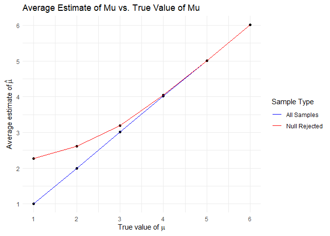
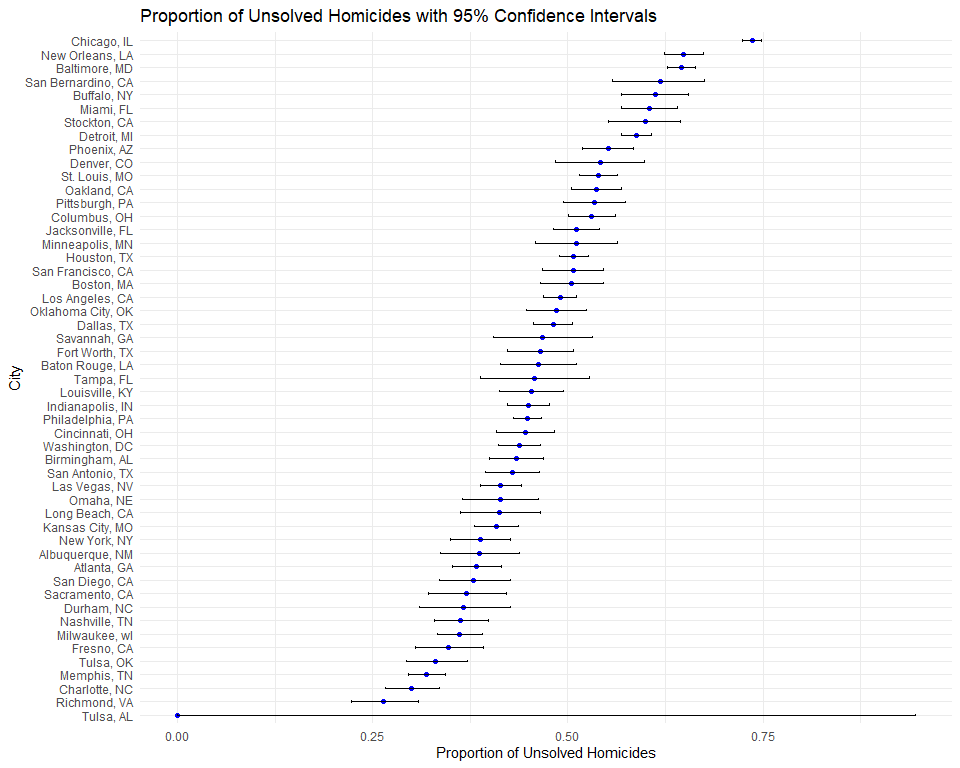

p8105_hw5_WL3011
================
Weiqi Liang
2024-11-13

## Setup File

``` r
library(tidyverse)
library(ggplot2)
library(broom)
library(dplyr)
library(purrr)
set.seed(1)
```

## Problem 1

``` r
bday_sim = function(n){
  
  #365 days, 10 people. Allow the same birthday
  bdays = sample(1:365, size = n, replace = TRUE)

  #check if anyone has the same birthday
  duplicate = length(unique(bdays)) < n 

  return(duplicate)
}
```

``` r
sim_res = 
  expand_grid(
    n = 2:50,
    iter = 1:10000
  ) |>
  mutate(res = map_lgl(n, bday_sim)) |>
  group_by(n) |>
  summarise(prob = mean(res))

sim_res |>
  ggplot(aes(x = n, y = prob)) +
  geom_line(color = "blue") +
  geom_point() +
  labs(
    x = "Group Size",
    y = "Probability of Shared Birthday",
    title = "Probability of At Least Two People Sharing a Birthday"
  ) +
  theme_minimal()
```

<!-- -->

As the group size increases, the probability that at least two people
share the same birthday increases rapidly. When the group size is about
23 people, the probability is closer to 0.5 (50%), meaning that in a
group of 23 people, there is a 50% chance that at least two people will
have the same birthday. When the group size approaches 50 people, the
probability approaches 1 (100%), indicating that it is almost certain
that at least two people in such a group will share a birthday.

## Problem 2

``` r
# Simulation parameters
n = 30
sigma = 5
iter = 5000
alpha = 0.05
mu_values = 1:6

results = tibble(mu = numeric(), estimate = numeric())

for (mu in mu_values) {
  simulations = 
    replicate(iter, 
              {
    sample_data = rnorm(n, mean = mu, sd = sigma)
    test_result = t.test(sample_data, mu = 0)
    tidy(test_result) |>
      select(estimate, p.value) |>
      mutate(mu = mu)  
              }, simplify = FALSE) |> 
    bind_rows()
  
  results = bind_rows(results, simulations)
}
```

``` r
power_res = results |>
  group_by(mu) |>
  summarize(power = mean(p.value < alpha))

# Plot power vs true value of mu
ggplot(power_res, aes(x = mu, y = power)) +
  geom_line(color = "blue") +
  geom_point() +
  labs(
    x = expression("True value of" ~ mu),
    y = "Power of the test",
    title = "Power of the t-Test vs. True Value of Mu"
  ) +
  scale_x_continuous(
    breaks = seq(1, 6, by = 1) 
  ) + 
  theme_minimal()
```

<!-- -->

This figure shows the relationship between statistical power of the
t-test and the truth value of $\mu$. When $\mu = 1$, the power is lower
than 0.25, indicating that the test is difficult to detect the
difference. With the increase of $\mu$, the efficacy increases rapidly.
When mu reaches 4 and above, the efficacy reaches 1 (100%), indicating
that the test almost always correctly rejects the null hypothesis under
these conditions.

``` r
estimate_data = results |>
  group_by(mu) |>
  summarize(
    avg_estimate_all = mean(estimate),
    avg_estimate_rejected = mean(estimate[p.value < alpha], na.rm = TRUE)
  )

# Plot average estimate of mu vs. true value of mu for all samples
ggplot(estimate_data, aes(x = mu)) +
  geom_point(aes(y = avg_estimate_all)) +
  geom_point(aes(y = avg_estimate_rejected)) +
  geom_line(aes(y = avg_estimate_all, color = "All Samples")) +
  geom_line(aes(y = avg_estimate_rejected, color = "Null Rejected")) +
  labs(
    x = expression("True value of" ~ mu),
    y = expression("Average estimate of" ~ hat(mu)),
    title = "Average Estimate of Mu vs. True Value of Mu"
  ) +
  scale_x_continuous(
    breaks = seq(1, 6, by = 1) 
  ) + 
  scale_y_continuous(
    breaks = seq(1, 6, by = 1) 
  ) + 
  scale_color_manual(name = "Sample Type", values = c("All Samples" = "blue", "Null Rejected" = "red")) +
  theme_minimal()
```

<!-- -->

The sample average of $\hat\mu$ across tests for which the null is
rejected approximately not equal to the true value of $\mu$. When
considering only samples that reject the null hypothesis, the average
estimate $\hat\mu$ will generally deviate from the true value $\mu$.
This is because in the case where the null hypothesis is rejected, a
larger $\hat\mu$ may be favored due to selection bias.

## Problem 3

``` r
homicide_data = read_csv("./homicide-data.csv", 
           na = c("NA", ".", "")) |>
           janitor::clean_names() |>
  mutate(city_state = paste(city, state, sep = ", ")) |>
  group_by(city_state) |>
  summarize(
    total_homicides = n(),
    unsolved_homicides = sum(disposition %in% c("Closed without arrest", "Open/No arrest"))
  )

baltimore_data =
  homicide_data |>
  filter(city_state == "Baltimore, MD")

baltimore_prop_test =
  prop.test(
  baltimore_data |> pull(unsolved_homicides),
  baltimore_data |> pull(total_homicides)
)

baltimore_result = 
  tidy(baltimore_prop_test) |>
  mutate(
    estimate_mu = estimate,
    CI = paste0("(", round(conf.low, 4), ", ", round(conf.high, 4), ")")
  ) |>
  select(estimate, CI)
```

``` r
knitr::kable(baltimore_result)
```

|  estimate | CI               |
|----------:|:-----------------|
| 0.6455607 | (0.6276, 0.6632) |

``` r
city_result = homicide_data |>
  mutate(
    prop_test = map2(unsolved_homicides, total_homicides, ~ prop.test(.x, .y) |> tidy())
  ) |>
  unnest(prop_test) |>
  select(city_state, estimate, conf.low, conf.high)

city_result_table = city_result |>
  mutate(
    ci = paste0("(", round(conf.low, 4), ", ", round(conf.high, 4), ")")
  ) |>
  select(city_state, estimate, ci)
```

``` r
ggplot(city_result, aes(x = reorder(city_state, estimate), y = estimate)) +
  geom_point(color = "blue") +
  geom_errorbar(aes(ymin = conf.low, ymax = conf.high), width = 0.2) +
  labs(
    x = "City",
    y = "Proportion of Unsolved Homicides",
    title = "Proportion of Unsolved Homicides with 95% Confidence Intervals"
  ) +
  theme_minimal() +
  coord_flip()
```

<!-- -->
