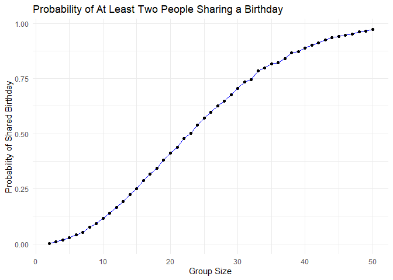
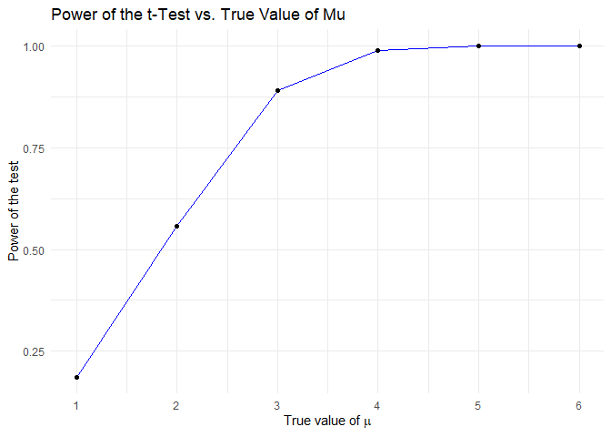

p8105_hw5_WL3011
================
Weiqi Liang
2024-11-12

## Setup File

``` r
library(tidyverse)
library(ggplot2)
library(broom)
library(dplyr)
set.seed(1)
```

## Problem 1

``` r
bday_sim = function(n){
  
  #365 days, 10 people. Allow the same birthday
  bdays = sample(1:365, size = n, replace = TRUE)

  #check if anyone has the same birthday
  duplicate = length(unique(bdays)) < n 

  return(duplicate)
}
```

``` r
sim_res = 
  expand_grid(
    n = 2:50,
    iter = 1:10000
  ) |>
  mutate(res = map_lgl(n, bday_sim)) |>
  group_by(n) |>
  summarise(prob = mean(res))

sim_res |>
  ggplot(aes(x = n, y = prob)) +
  geom_line(color = "blue") +
  geom_point() +
  labs(
    x = "Group Size",
    y = "Probability of Shared Birthday",
    title = "Probability of At Least Two People Sharing a Birthday"
  ) +
  theme_minimal()
```

<!-- -->

## Problem 2

``` r
# Simulation parameters
n = 30
sigma = 5
iter = 50
alpha = 0.05
mu_values = 1:6

results = tibble(mu = numeric(), estimate = numeric())

for (mu in mu_values) {
  simulations = 
    replicate(iter, 
              {
    sample_data = rnorm(n, mean = mu, sd = sigma)
    test_result = t.test(sample_data, mu = 0)
    tidy(test_result) |>
      select(estimate, p.value) |>
      mutate(mu = mu)  
              }, simplify = FALSE) |> 
    bind_rows()
  
  results = bind_rows(results, simulations)
}
```

``` r
power_res = results |>
  group_by(mu) |>
  summarize(power = mean(p.value < alpha))

# Plot power vs true value of mu
ggplot(power_res, aes(x = mu, y = power)) +
  geom_line(color = "blue") +
  geom_point() +
  labs(
    x = expression("True value of" ~ mu),
    y = "Power of the test",
    title = "Power of the t-Test vs. True Value of Mu"
  ) +
  scale_x_continuous(
    breaks = seq(1, 6, by = 1) 
  ) + 
  theme_minimal()
```

<!-- -->

``` r
estimate_data = results |>
  group_by(mu) |>
  summarize(
    avg_estimate_all = mean(estimate),
    avg_estimate_rejected = mean(estimate[p.value < alpha], na.rm = TRUE)
  )

# Plot average estimate of mu vs. true value of mu for all samples
ggplot(estimate_data, aes(x = mu)) +
  geom_line(aes(y = avg_estimate_all, color = "All Samples")) +
  geom_line(aes(y = avg_estimate_rejected, color = "Null Rejected")) +
  labs(
    x = expression("True value of" ~ mu),
    y = expression("Average estimate of" ~ hat(mu)),
    title = "Average Estimate of Mu vs. True Value of Mu"
  ) +
  scale_x_continuous(
    breaks = seq(1, 6, by = 1) 
  ) + 
  scale_y_continuous(
    breaks = seq(1, 6, by = 1) 
  ) + 
  scale_color_manual(name = "Sample Type", values = c("All Samples" = "blue", "Null Rejected" = "red")) +
  theme_minimal()
```

<!-- -->

When considering only samples that reject the null hypothesis, the
average estimate $\hat\mu$ will generally deviate from the true value
$\mu$. This is because in the case where the null hypothesis is
rejected, a larger $\hat\mu$ may be favored due to selection bias.
